# Social Media Website
A website for developers built using the MERN stack. Now experience LinkedIn + Stackoverflow at a single place! 

Create your portfolio profile, add details like your educational credentials and experience, create posts, like/unlike and comment on posts by other members of the community. Users can also give mock quiz on the website to brush up their knowledge. The "Covid Relief" section of the website provides real time tweets related to COVID-19 relief, medicines, oxgyen cylinders etc. 

## Website is live [here](https://shreybook.herokuapp.com/).
<br /><br />
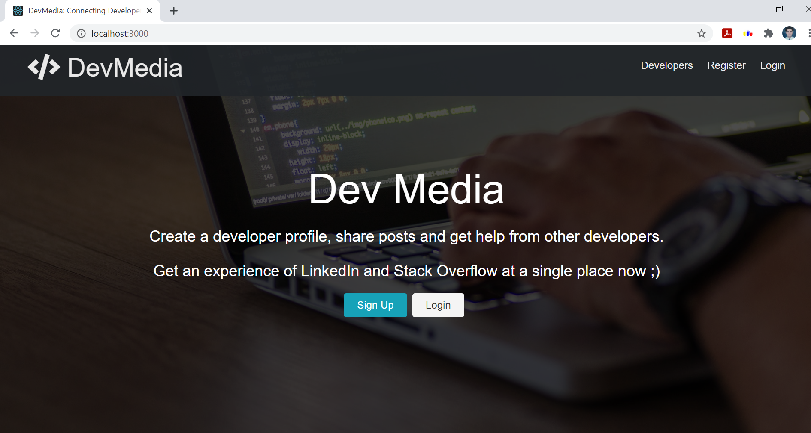
</img>   

<br/><br/>
## 🚀Technology Stack

* JavaScript  <a href=""></a>
* React  <code></code>
* Mongo DB  <a href=""></a>
* Express  <a href=""></a>
* Node JS  <a href=""></a>
* CSS  <a href=""></a>
* HTML5  <a href=""></a>


## Specialities of the Website
* Safe and secure authorization and authentication.
* Users can create their own portfolio profile.
* Create posts and view posts by other members of the community.
* Like and comment on posts created by others.
* Give mock quiz to brush up your knowledge.
* Get Real time tweets related to Corona virus pandemic.
<br/>

## State Management

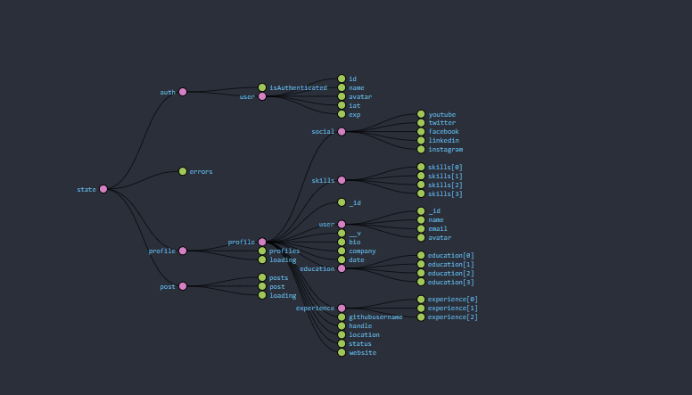
</img> 


## :camera_flash: ScreenShots   
| Landing Page | Sign Up Page|
|------|-------|
||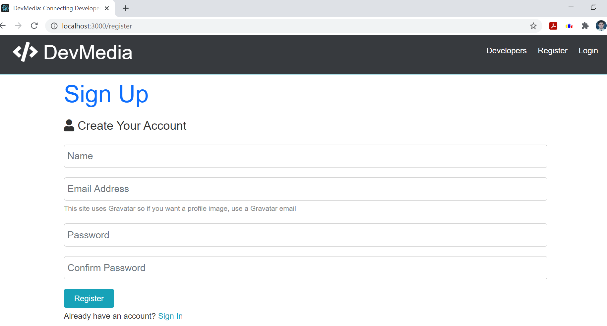|


| Sign In Page | Dashboard (User Experience info) |
|------|-------|
|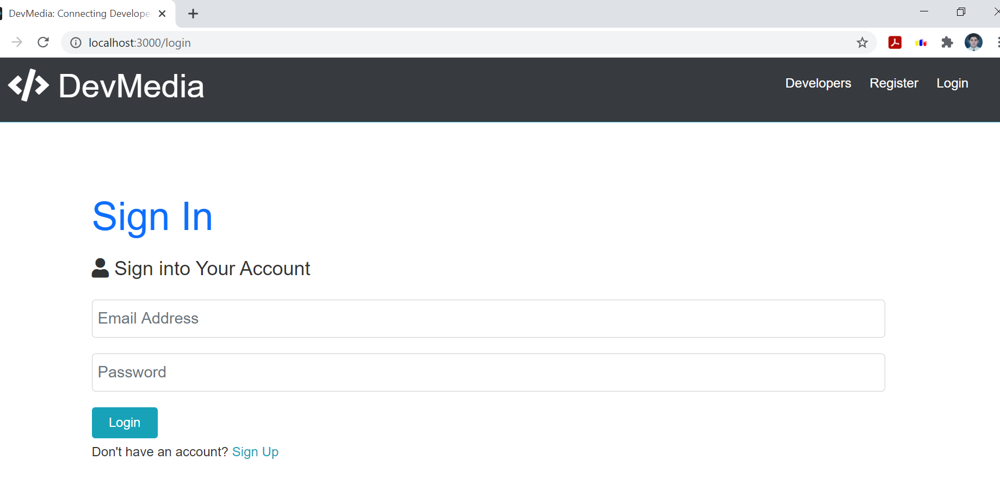|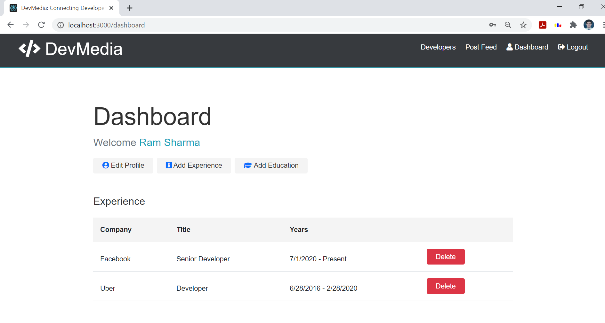|


| Dashboard (User Education info) | List of Developer Profiles |
|------|-------|
|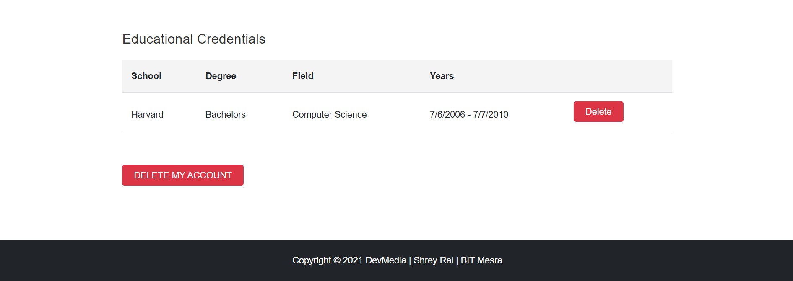|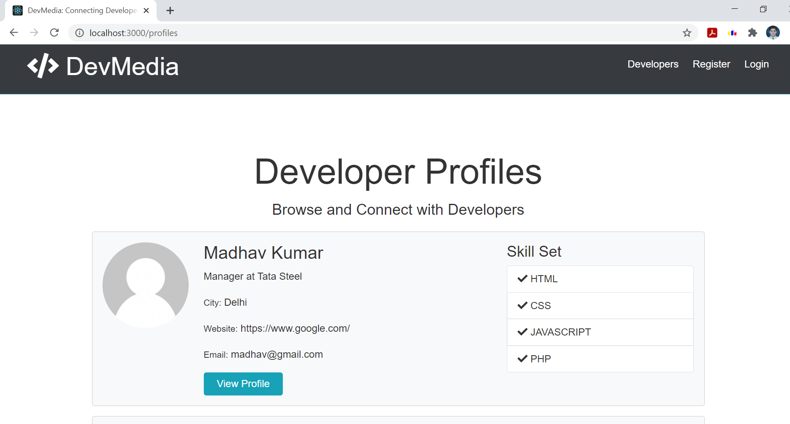|


| Portfolio Profile of users-1  | Portfolio Profile of users-2 |
|------|-------|
|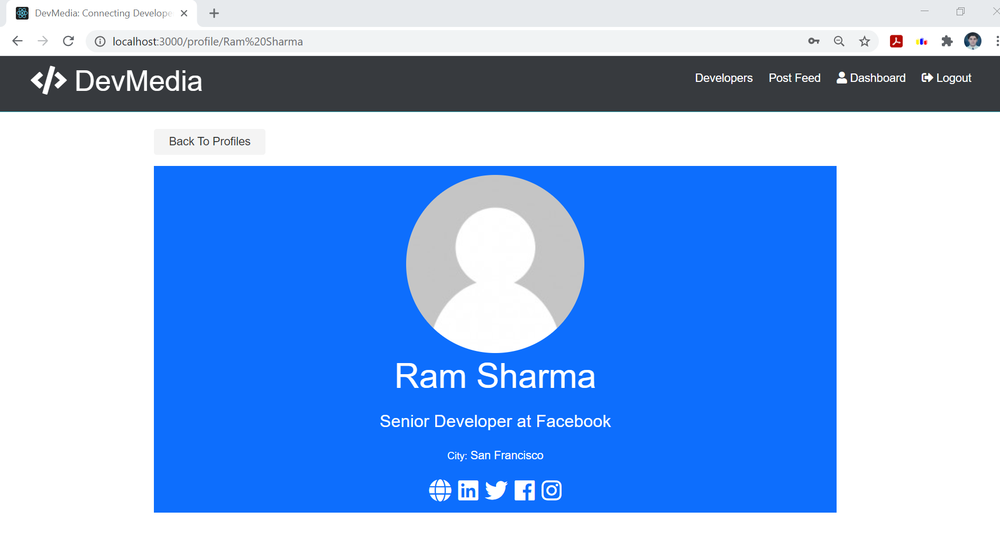|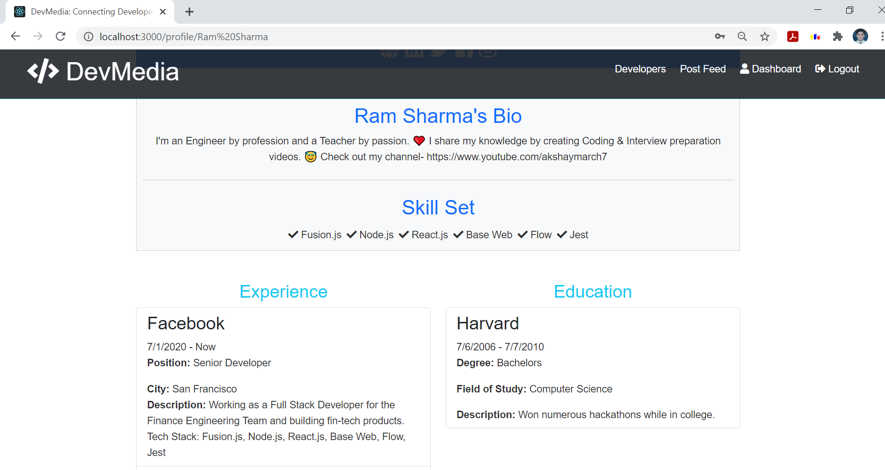|


| Post Feed (Like,unlike,delete,create posts) | Post Feed (Comment on posts) |
|------|-------|
|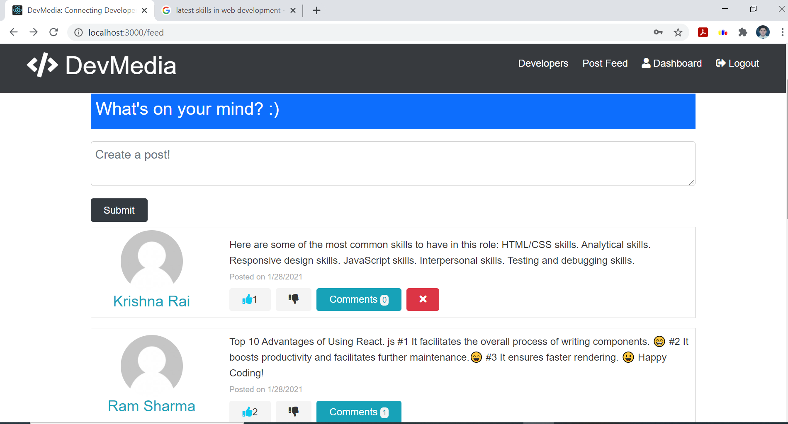|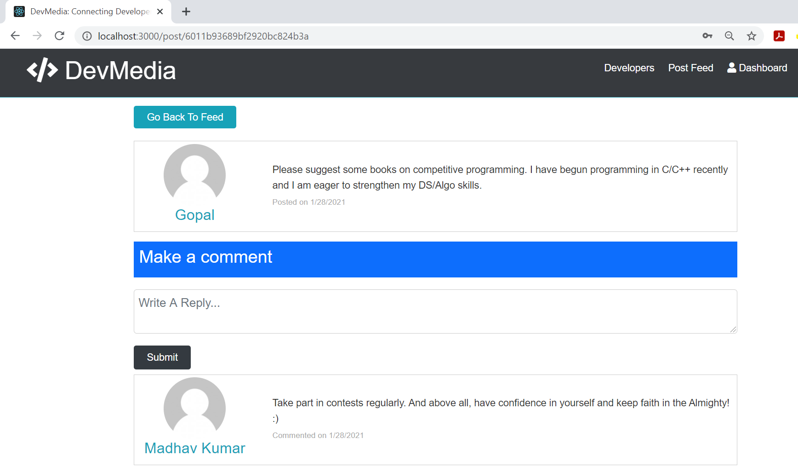|


| Give Mock Quiz | Practise MCQ Questions |
|------|-------|
|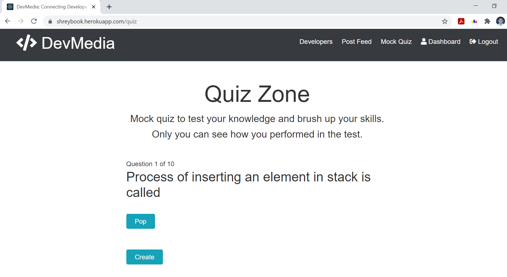|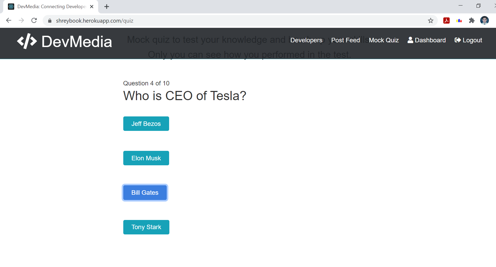|


| Get Quiz Marks | State of Website |
|------|-------|
|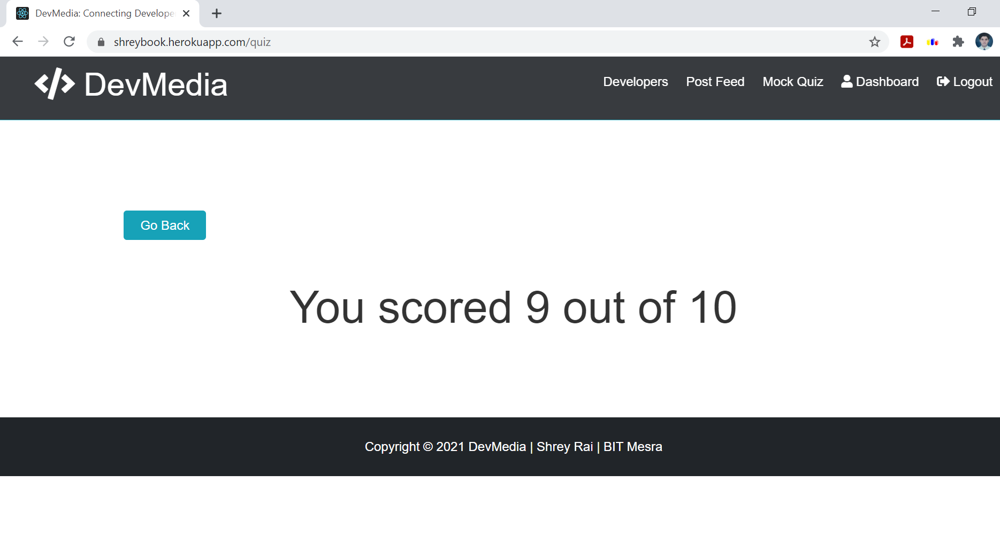||


| Real time Tweet Streamer | Get Covid Information |
|------|-------|
|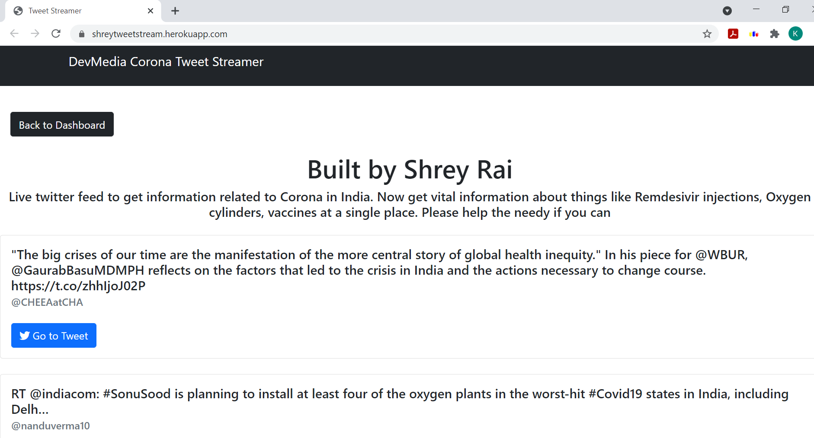|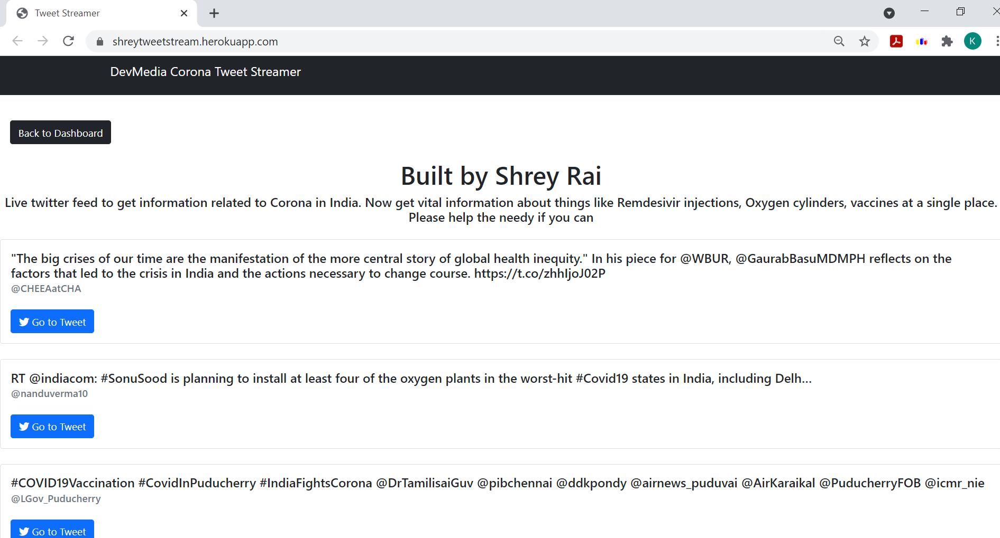|

<br/><br/>
## Run Locally
#### Clone the repository: 
```bash
git@github.com:shreyrai99/social-media-website.git
```
#### Install Server dependencies: 
```bash
npm install
```
#### Install Client Dependencies:
```bash
cd client
npm install
```
#### Run Express and React
```bash
cd ..
npm run dev
```
#### Check in Browser
```bash
 http://localhost:5000/ : The Backend runs at port 5000
 http://localhost:3000/ : The Front-end runs at port 3000
```


## DevMedia: Connecting Coders 
Visit the Website [here](https://shreybook.herokuapp.com/).
